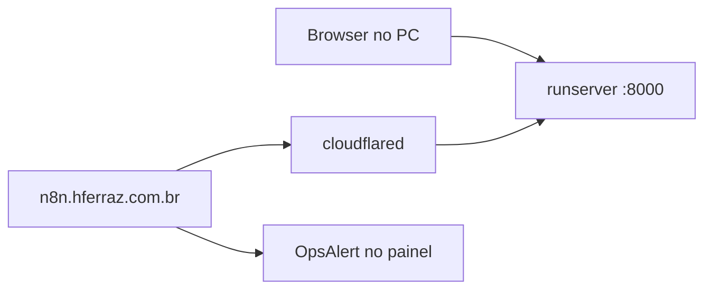

# Fase B — n8n EasyPanel + TechParts só em localhost

O n8n (**https://n8n.hferraz.com.br/**) está na internet. O TechParts no seu PC **não** é visível como `localhost`. A solução da demo é um **túnel HTTPS** que aponta para `http://127.0.0.1:8000`. Enquanto o túnel e o `runserver` estiverem ligados, o n8n consegue chamar o app.

Não use no n8n: `localhost`, `127.0.0.1`, `host.docker.internal`.

---

## O que você vai fazer

1. Ligar o Django na porta 8000.
2. Ligar um túnel e copiar a URL `https://….trycloudflare.com`.
3. Colar essa URL nos dois nodes HTTP do n8n.
4. Executar o workflow e ver o alerta em **http://127.0.0.1:8000/dashboard/monitoramento/** (seu browser continua no localhost).

O túnel é só para o **n8n** falar com o app.

---

## Terminal 1 — TechParts

```bash
source .venv/bin/activate
make runserver
# ou: cd backend && python3 manage.py runserver
```

Confirme: http://127.0.0.1:8000/ops/hooks/lowcode/ mostra `"status": "ok"`.

Deixe este terminal **aberto**. Reinicie o `runserver` se acabou de puxar o código (hosts de túnel entram no `settings.local`).

---

## Terminal 2 — túnel

Com o Django já no ar:

```bash
npx --yes cloudflared tunnel --url http://127.0.0.1:8000
```

Copie a URL **sem barra no final**, por exemplo:

```text
https://random-words-1234.trycloudflare.com
```

Ela **muda** toda vez que o `cloudflared` reinicia. Os dois terminais precisam ficar ligados na hora do **Execute workflow**.

Teste no navegador:

`https://ESSA-URL.trycloudflare.com/ops/hooks/lowcode/?demo=1`

Tem que voltar JSON com `"demo": true`.

---

## No n8n (https://n8n.hferraz.com.br/)

Workflow já criado no projeto pessoal: [TechParts — snapshot ops](https://n8n.hferraz.com.br/workflow/xOru4XDHJhmWLSB4) (rascunho, não publicado). Se precisar recriar: **⋮ → Import from File** → `docs/lowcode/n8n-techparts-ops.json`.

Caminho mais simples: **colar a URL do túnel** nos nodes (não precisa reiniciar o EasyPanel).

1. Abra o workflow acima.
2. Node **GET snapshot TechParts**
   - Method: `GET`
   - URL:

```text
https://random-words-1234.trycloudflare.com/ops/hooks/lowcode/?demo=1
```

   - Header `X-Lowcode-Secret`: o valor de `LOWCODE_WEBHOOK_SECRET` no `.env` (token, **não** a URL do túnel). Vazio só se o `.env` também estiver vazio.
3. Node **POST relatório no painel**
   - Method: `POST`
   - URL:

```text
https://random-words-1234.trycloudflare.com/ops/hooks/lowcode/report/
```

   - Mesmo header.
   - Se o body em expressão falhar, use JSON fixo:

```json
{
  "source": "n8n",
  "title": "Alerta ops (n8n)",
  "message": "Demo Fase B — TechParts via túnel",
  "failures_24h": 1,
  "queues": { "awaiting_review": 1 },
  "severity": "warning"
}
```

4. **Execute workflow** → nodes verdes.
5. No PC: http://127.0.0.1:8000/dashboard/monitoramento/ (login staff) → alerta.

Toda vez que o túnel mudar de URL, atualize os dois nodes.

### Variável no EasyPanel (opcional)

No serviço n8n → Environment: `TECHPARTS_BASE_URL` = URL do túnel (sem `/` no final). Reinicie o n8n. Os nodes importados usam `={{ $env.TECHPARTS_BASE_URL }}/ops/hooks/lowcode/?demo=1`.

---

## Se o GET no n8n falhar

| Erro | O que fazer |
|---|---|
| Timeout | Túnel ou `runserver` caiu |
| `401` | Secret diferente; nos dois vazio ou o mesmo texto |
| 502 Cloudflare | Espere o túnel registrar a conexão |
| Host inválido | Reinicie o `runserver` (código com `.trycloudflare.com` no `ALLOWED_HOSTS`) |
| URL antiga | Cole o host novo do `cloudflared` |

---

## Nodes (referência)

| Node | Função |
|---|---|
| Executar agora (demo) | Botão da demo/vídeo |
| A cada 15 min | Não ative o workflow até gravar a demo |
| GET snapshot | `?demo=1` força alerta |
| App pediu alerta? | IF `alert_recommended` |
| POST relatório | Cria `OpsAlert` |
| Sem alerta | NoOp |

---

## Diagrama



| Quem chama | URL |
|---|---|
| Você no PC | `http://127.0.0.1:8000/...` |
| n8n | `https://….trycloudflare.com/ops/hooks/lowcode/?demo=1` e `.../report/` |
