# Plano de Tarefas — E-commerce de Peças com IA

Plano de tarefas e subtarefas para desenvolver o sistema completo, alinhado ao roadmap técnico, à constitution, ao specify e aos **24 pilares** (incluindo qualidade visual e experiência do usuário).

**Stack:** Python + Django + htmx + Bootstrap + PostgreSQL/pgvector + Celery + LangChain/LangGraph + Cloudflare R2

**Fontes:** [`plano-ecommerce-ia-pecas.md`](plano-ecommerce-ia-pecas.md) · [`pilares-app-ia-vendas-pecas.md`](pilares-app-ia-vendas-pecas.md) · [`pilares/`](pilares/) · [`constitution.md`](constitution.md) · [`specify.md`](specify.md) · [`DESIGN.md`](DESIGN.md) · [`plan.md`](plan.md)

---

## Regras base (obrigatórias)

Estas regras valem para **todas as fases** e para qualquer agente/dev que execute o plano.

### R1 — Versões estáveis mais recentes

Todo sistema, runtime, biblioteca, ferramenta de CLI ou material instalado/adicionado ao projeto deve usar a **maior versão estável disponível no momento da instalação daquela fase** (não betas, RCs ou nightlies, salvo exceção explícita e registrada em ADR).

- Inclui: Python, Django, Bootstrap, PostgreSQL/pgvector, Redis, Celery, LangChain/LangGraph, Node (se necessário para tooling), Docker images base, actions do CI, etc.
- Ao iniciar uma fase que introduz dependência nova: consultar a versão estável atual e fixar no lock/`requirements`/`package` com essa versão.
- Não “congelar para sempre” no início do projeto se uma fase posterior for a primeira a instalar o pacote — usa-se a estável **daquela** data.
- Upgrades major no meio de uma fase só com motivo (CVE, bloqueio) e registro curto.

### R2 — Git por fase: PR no início, merge na `main` no fim

Cada fase (F0, F1, F2, F3, **F4a, F4b, F4c, F4d**, F5, F6, F7, F8) é uma unidade de entrega na `main`.

**Decisões confirmadas (2026-08-04):**

| # | Decisão |
|---|---|
| D1 | F4a–F4d = **4 PRs/merges distintos** na `main` |
| D2 | Merge = **squash** na `main`, CI verde (quando houver), branch remota apagada |
| D3 | No início da fase: branch + push + abrir PR (draft ok); **sem** commit vazio; primeiro commit útil abre o histórico |
| D4 | R1 = maior estável **na data em que a dependência entra** naquela fase |
| D5 | **F1 é PR só de docs** (escopo/schema) — válido e obrigatório como primeira entrega |
| D6 | Sequência fixa de merge: **F1 → F0 → F2 → …** (F0 e F2 **não** compartilham a mesma PR) |
| D7 | Projeto solo: **merge automático ao fim da fase**, sem review humano obrigatório; se branch protection bloquear, ajustar proteção ou usar `--admin` conforme política do repo |
| D8 | **Primeira ação da F1:** inicializar git + remote GitHub + `main`, se ainda não existirem |

**Bootstrap do repositório (antes ou como T-1.0 da F1):**

1. `git init`, branch `main`, `.gitignore` adequado
2. Commit inicial na `main` (docs existentes, se ainda não versionados)
3. Criar repo no GitHub (`gh repo create`) e `git push -u origin main`
4. A partir daí, aplicar o ciclo abaixo em **toda** fase

**Antes de iniciar a fase (obrigatório, automático):**

1. Garantir working tree limpa a partir de `main` atualizada (`git pull` / sync com remote).
2. Criar branch `fase/<id>-<slug>` (ex.: `fase/4a-catalogo-estoque-carrinho`).
3. Commit inicial da fase se já houver artefatos pendentes alinhados ao escopo (ex.: docs da fase); senão, commit vazio **não** — o primeiro commit útil abre o histórico.
4. `git push -u` da branch.
5. Abrir PR para `main` (`gh pr create`) com título/corpo citando a fase, pilares e checklist de aceite — PR pode começar como draft e sair de draft quando o aceite da fase estiver completo.

**Durante a fase:**

- Commits frequentes na branch da fase (Conventional Commits).
- CI da PR deve passar antes do merge (a partir da F2, quando o CI existir; na F1/F0 docs-only, merge após aceite das tarefas).

**Ao finalizar a fase (obrigatório, automático):**

1. Conferir aceite de todas as tarefas `T-X.Y` da fase + DoD visual/UX quando houver UI.
2. Garantir CI verde na PR (quando aplicável).
3. Tirar PR de draft se necessário; merge squash na `main` (`gh pr merge --squash --delete-branch`) **sem aguardar review humano** (D7).
4. Só então iniciar a próxima fase (nova branch a partir da `main` já atualizada).

**Exceções:**

- F8: cada item grande (WhatsApp, assinatura, etc.) pode ter PR próprio sob o guarda-chuva da fase, com aceite explícito do item antes do merge.

### R3 — Testes automatizados e unitários (obrigatórios)

Testes não são “fase opcional”: são regra de entrega a partir da **F2** (quando o código e o CI nascem). Alinha P06, constitution Art. 5 e o gate de merge da R2.

**O que é obrigatório**

| Tipo | Ferramenta | Quando |
|---|---|---|
| Unitários | pytest (+ Django TestCase / pytest-django) | Todo código de domínio novo (models, services, parsers, validators) |
| Integração | pytest + DB/Redis de teste | Fluxos que cruzam apps (estoque+carrinho, upload+task, etc.) |
| Tasks Celery | pytest com eager/mocks | Extração, embeddings, NF-e, e-mails |
| IA | mocks da API Anthropic + golden set | Extração/RAG — **nunca** chamar API paga no CI unitário |
| E2E | Playwright (a partir de F4b/F5) | Checkout, chamado, chat — caminhos críticos |
| Estáticos | ruff, black --check, bandit, check migrations | Todo PR com código |

**Regras de execução**

1. **Nenhuma feature de código mergeia sem testes que cubram o caminho feliz e ao menos um caso de erro/edge** relevante ao aceite da tarefa.
2. Testes da mudança rodam **localmente antes do push** e de novo no **CI da PR**; merge só com CI verde (R2/D2).
3. **Cobertura mínima** nos fluxos críticos (checkout, pagamento, extração de IA): meta **≥ 80%** (pytest-cov no CI), verificada a partir da F4b/F3 conforme o código existir.
4. **Novo comportamento = novo teste** na mesma PR; regressão sem teste que a pegaria é débito proibido no merge.
5. Chamadas reais a Claude/Anthropic **fora** do CI unitário; no CI usar fixtures/mocks. Golden set (F3 local → F6 no CI) valida prompts/extração com gabarito conhecido.
6. F1 e F0 (docs / fundação visual sem app): testes automatizados de app **não se aplicam**; a partir da F2, pipeline pytest existe mesmo que a suíte inicial seja mínima (“smoke”).
7. Stack de teste também segue **R1** (maior pytest/pytest-django/Playwright estável na instalação).

**Gate de merge (resumo)**

```
lint + typecheck(opcional) + pytest(+cov) + migrations check [+ e2e se a fase já tiver]
        → CI verde → squash merge na main
```

---
## Como usar este documento

| Campo | Significado |
|---|---|
| `T-X.Y` | Tarefa da fase X |
| Subtarefas | Checklist acionável |
| Pilares | P01–P24 materializados pela tarefa |
| Aceite | Critério objetivo de “pronto” |

Toda tela/fluxo de UI deve passar pelo [Definition of Done visual/UX](#definition-of-done-visualux) antes de ser considerada concluída.

**Checklist Git (por fase):** ver [R2](#r2--git-por-fase-pr-no-início-merge-na-main-no-fim).  
**Checklist testes:** ver [R3](#r3--testes-automatizados-e-unitários-obrigatórios).

```mermaid
flowchart LR
  F1[F1 Escopo] --> F0[F0 DesignSystem]
  F0 --> F2[F2 Base CI Docker]
  F2 --> F3[F3 Ingestao Manuais]
  F3 --> F4a[F4a Catalogo]
  F4a --> F4b[F4b Checkout]
  F4b --> F4c[F4c Chamados]
  F4c --> F4d[F4d Cupons Trocas]
  F4d --> F5[F5 Chat RAG]
  F5 --> F6[F6 LangGraph]
  F6 --> F7[F7 Beta Dashboard]
  F7 --> F8[F8 Escala]
```



Ordem de merge na `main` (R2): **F1 → F0 → F2 → F3 → F4a → F4b → F4c → F4d → F5 → F6 → F7 → F8**.

---

## Fase 0 — Fundação visual e UX

> Objetivo: materializar o design system **Industrial Precision** antes do catálogo, para que toda UI nasça no padrão certo.  
> **Git:** após merge da F1; antes da F2 (ver R2).  
> Pilares centrais: **P16, P17, P18, P19, P20, P21, P22, P24**  
> **Entrega:** [`design-system/`](../design-system/) · preview · BRAND · checklist

### T-0.1 — Tokens e tema Bootstrap customizado

**Pilares:** P16, P17, P24

- [x] Definir variáveis CSS/SCSS a partir de [`docs/design/DESIGN.md`](design/DESIGN.md) (Industrial Navy, AI Cyan, Tech Gray, surfaces, success/danger)
- [x] Configurar tipografia: Inter (UI) + JetBrains Mono (specs/SKU)
- [x] Mapear tokens para overrides do Bootstrap 5 (cores, radii 4px, espaçamento base 4px) — **Bootstrap 5.3.8**
- [x] Documentar uso: cyan **somente** em features de IA
- [x] Página/story de tokens (preview interno) para validação visual

**Aceite:** tema Bootstrap não parece “tema padrão”; tokens documentados e aplicáveis em templates. ✅

### T-0.2 — Componentes reutilizáveis

**Pilares:** P16, P17, P19, P20

- [x] Botões: Primary (navy), AI Action (cyan), Ghost/Outline
- [x] Product Card (foto, brand label-caps, título, linha técnica mono, badge)
- [x] Status Badges (estoque, rascunho, SLA)
- [x] Inputs e tabelas densas (foco navy 2px)
- [x] Shell do AI Chat (header cyan, bolhas, tag de fonte técnica)
- [x] Skeletons, empty states e error states com ação de recuperação
- [x] Ícones Material Symbols Outlined de forma consistente

**Aceite:** componentes renderizam em desktop e mobile; checklist DoD visual passa. ✅ → `design-system/preview/index.html`

### T-0.3 — Layout, responsividade e acessibilidade base

**Pilares:** P21, P22

- [x] Grid 12/8/4 (desktop/tablet/mobile), container max 1280px na loja
- [x] Margens/gutters conforme design system
- [x] Contraste WCAG AA em textos, botões e badges
- [x] Navegação por teclado e foco visível
- [x] Padrão de `alt` em imagens/ícones

**Aceite:** layout base mobile-first; auditoria rápida de contraste e teclado OK. ✅

### T-0.4 — Guia de marca e checklist de revisão visual

**Pilares:** P18, P24

- [x] Registrar tom técnico/industrial (não consumer “fofo”)
- [x] Regras de fotografia de produto (fundo neutro, ângulo, iluminação)
- [x] Checklist de revisão visual por PR/tela (ligar ao DoD abaixo)
- [x] Referenciar protótipos em `docs/design/` e `docs/src/` como meta visual

**Aceite:** qualquer nova tela pode ser revisada contra um checklist único. ✅ → [`design-system/docs/VISUAL-REVIEW-CHECKLIST.md`](../design-system/docs/VISUAL-REVIEW-CHECKLIST.md)

**Encerramento F0 (R2/D7):** squash merge na `main` → iniciar F2.

---

## Fase 1 — Descoberta e escopo do MVP

> Objetivo: travar o que entra no MVP e o schema mínimo para vender.  
> Entrega: **PR só de documentação** (D5).  
> Pilares: **P01**  
> **Git:** primeira fase — inclui bootstrap do repositório (D8).

### T-1.0 — Bootstrap Git + remote GitHub

**Pilares:** P14 (base), R2

- [x] Verificar se já existe `.git` e remote; se **não**, executar bootstrap (D8)
- [x] `git init`, branch `main`, `.gitignore` (Python/Django/Node/env/secrets)
- [x] Commit inicial na `main` com a documentação já existente em `docs/` (e demais arquivos do repo que devam versionar)
- [x] Criar repositório no GitHub e `git push -u origin main`
- [x] Abrir branch `fase/1-escopo-mvp` + PR draft para o trabalho de T-1.1/T-1.2

**Aceite:** `main` existe no GitHub; PR da F1 aberta; working tree pronta para docs de escopo. ✅ (2026-08-04)

### T-1.1 — Escopo comercial e de IA

**Pilares:** P01

- [x] Definir categorias MVP (ex.: ventiladores de teto + peças de reposição)
- [x] Listar fabricantes/manuais de validação (mín. 3 layouts diferentes)
- [x] Confirmar critérios de sucesso de [`specify.md`](specify.md) §7
- [x] Explicitar fora de escopo imediato (WhatsApp, multi-idioma prod, PWA, assinatura, assistências)
- [x] Registrar decisão: IA só entra se transformar manual em venda, suporte ou economia

**Aceite:** documento de escopo MVP aprovado; lista de manuais de teste definida. → [`fase-1-escopo-mvp.md`](fase-1-escopo-mvp.md)

### T-1.2 — Schema mínimo de produto

**Pilares:** P01, P11

- [x] Definir campos mínimos de `Product` para vender (SKU, nome, preço, estoque, specs-chave, compatibilidade)
- [x] Prever i18n no schema sem implementar conteúdo multi-idioma
- [x] Mapear campos extraíveis do manual → schema

**Aceite:** schema mínimo documentado e alinhado à F3/F4a. → [`fase-1-schema-produto.md`](fase-1-schema-produto.md)

**Encerramento F1 (R2/D7):** marcar PR ready → squash merge na `main` → apagar branch → só então iniciar F0.

---

## Fase 2 — Base do projeto

> Objetivo: monólito modular com cinto de segurança desde o dia 1.  
> Pilares: **P04, P05, P06, P07, P12, P13, P14, P15** (+ layout base da F0)  
> **Git:** após merge da F0; branch `fase/2-base-django-ci-docker`.

### T-2.1 — Estrutura do monólito Django

**Pilares:** P04, P12

- [x] Criar apps: `accounts`, `catalog`, `products`, `cart`, `checkout`, `orders`, `tickets`, `ai`, `manuals`, `compatibility`, `dashboard`, `notifications`, `core`
- [x] Templates base + static com tema da F0
- [x] Header/nav e footer no padrão Industrial Precision
- [x] Configurar Django Templates + htmx + Alpine.js pontual
- [x] Settings por ambiente (local / staging / production)

**Aceite:** `runserver` sobe com layout base; apps vazios criados.

### T-2.2 — Docker e serviços locais

**Pilares:** P04, P14

- [x] Compose: Django, PostgreSQL (+ pgvector), Redis, Celery worker/beat, Flower, Nginx (opcional local)
- [x] Healthchecks básicos
- [x] Documentar `make up` / comandos de bootstrap

**Aceite:** stack sobe com um comando; Postgres com pgvector disponível.

### T-2.3 — CI/CD, qualidade e commits

**Pilares:** P06, P14 · **Regra:** R3

- [x] GitHub Actions: lint (ruff + black), testes pytest, check migrations
- [x] Pre-commit: black, ruff, detect-secrets
- [x] Conventional Commits + commitlint
- [x] Bandit + pip-audit/Dependabot
- [x] pytest + pytest-django + pytest-cov configurados; job de CI bloqueia merge se falhar
- [x] Suíte smoke inicial (ex.: health/settings) para a R3 valer desde o primeiro PR de código
- [x] Stub de coverage nos apps críticos (meta ≥ 80% em checkout/pagamento/extração quando existirem)

**Aceite:** PR sem lint/testes verdes não mergeia; commits padronizados; R3 aplicável.

### T-2.4 — Segurança, secrets e observabilidade base

**Pilares:** P05, P07, P13, P15

- [x] Secrets só via env / secret manager (nunca no repo)
- [x] HTTPS/HSTS, cookies secure/HttpOnly/SameSite, CSRF, CSP básico
- [x] Auth Django + grupos/RBAC inicial (admin, revisão catálogo, suporte)
- [x] structlog com `request_id`; mascaramento de PII
- [x] Sentry integrado (Django + Celery)
- [x] Rate limit stub nos endpoints futuros de IA

**Aceite:** app sem secrets no git; erro de teste aparece no Sentry de staging.

### T-2.5 — Contas, 2FA staff e auditoria

**Pilares:** P05, P15

- [x] Login/logout; proteção brute-force (django-axes ou equivalente)
- [x] 2FA obrigatório para staff/admin
- [x] Trilha de auditoria para ações sensíveis (base com django-simple-history ou equivalente)

**Aceite:** staff sem 2FA não acessa admin; ações sensíveis registradas.

**Encerramento F2 (R2/D7):** CI verde → squash merge na `main` → iniciar F3.

---

## Fase 3 — Pipeline de ingestão de manuais

> Objetivo: coração do diferencial — PDF → extração → revisão humana → rascunho.  
> Pilares: **P02, P09, P11** (+ P05/P15 uploads)  
> **Git:** após merge da F2; branch `fase/3-pipeline-ingestao-manuais`.

### T-3.1 — Models e storage de manuais

**Pilares:** P09, P11

- [x] Models: `Manual`, `ExtractionLog` (e vínculo futuro com `Product`)
- [x] Upload para Cloudflare R2 (django-storages); bucket privado; URLs assinadas
- [x] Validação MIME/tamanho + varredura antivírus antes do pipeline
- [x] Versionar PDF fonte vinculado ao produto/manual

**Aceite:** PDF sobe no R2; log de extração criado; arquivo hostil rejeitado. ✅ (R2 via `USE_R2_STORAGE`; local usa filesystem)

### T-3.2 — Extração de texto e estruturação com LangChain

**Pilares:** P02, P09

- [x] Extrair texto/tabelas (pdfplumber/unstructured); OCR se escaneado
- [x] Prompt versionado + `with_structured_output` / Pydantic (schema fixo)
- [x] Task Celery: PDF → JSON estruturado → produto/rascunho
- [x] Sanitizar conteúdo do manual antes do LLM (anti prompt injection via PDF)
- [x] Medir tokens/custo por execução (hook LangSmith)

**Aceite:** ≥3 manuais reais geram JSON válido no schema; custo visível por run. ✅ (mock heurístico no CI; Anthropic via `EXTRACTION_LLM_MODE=anthropic`)

### T-3.3 — Human-in-the-loop (revisão)

**Pilares:** P02, P08, P09

- [x] Produto nasce como **rascunho**; nunca publicar automático
- [x] Django admin + evolução para tela amigável de revisão (fila, confiança, diff)
- [x] Aprovar / corrigir / rejeitar com auditoria (quem, quando, o quê)
- [x] UI da fila alinhada ao protótipo (`AdminManualsView` / `code (cópia 2).html`)

**Aceite:** nada vai ao catálogo sem aprovação humana; auditoria completa. ✅ → `/manuais/revisao/`

### T-3.4 — Golden set inicial de extração

**Pilares:** P02, P06

- [x] Conjunto fixo de manuais + JSON esperado
- [x] Script/teste local de regressão (CI completo na F6)
- [x] Critério de qualidade mínimo para aprovação em massa

**Aceite:** regressão local detecta quebra de prompt. ✅ → `make golden` / `run_golden_set`

---

## Fase 4a — Catálogo, estoque e carrinho

> Objetivo: navegar, filtrar, ver produto e adicionar ao carrinho com estoque confiável.  
> Pilares: **P11, P12, P17, P18, P19, P20, P21, P23** (+ P16/P24)  
> **Git:** após merge da F3; branch `fase/4a-catalogo-estoque-carrinho`.

### T-4a.1 — Models de catálogo e estoque

**Pilares:** P11

- [x] `Product`, categorias, imagens, specs
- [x] Estoque: disponível, reservado, mínimo para alerta
- [x] Model de compatibilidade (modelo × peça)
- [x] Índices em SKU e compatibilidade
- [x] Cache Redis para listagens/consultas quentes

**Aceite:** migrations aplicadas; reserva de estoque testada unitariamente. ✅

### T-4a.2 — Listagem, busca e filtros

**Pilares:** P12, P21, P23

- [x] Catálogo com htmx (filtros: categoria, voltagem, modelo, compatibilidade)
- [x] Busca full-text Postgres + autocomplete com miniatura
- [x] Empty state (“nenhum produto”) com sugestão de busca/diagnóstico
- [x] Skeletons no carregamento de filtros
- [x] Mobile-first; DoD visual

**Aceite:** filtrar e buscar sem reload completo; UX mobile OK. ✅ → `/catalogo/`

### T-4a.3 — Página de produto (PDP)

**Pilares:** P17, P18, P20, P21

- [x] Hierarquia: nome > preço > specs > descrição
- [x] Specs em JetBrains Mono; whitespace generoso
- [x] Imagens (WebP/AVIF via R2), lazy loading; zoom/ângulos se disponível
- [x] Badge de compatibilidade; CTA Add to Cart / AI Action
- [x] Microinterações hover (~200ms)

**Aceite:** PDP alinhada aos protótipos; DoD visual passa. ✅

### T-4a.4 — Carrinho e reserva de estoque

**Pilares:** P12, P19, P20

- [x] Carrinho htmx (add/update/remove)
- [x] Reserva temporária no checkout para evitar overselling
- [x] Feedback imediato ao adicionar
- [x] Estados de erro (sem estoque) amigáveis

**Aceite:** não vende além do estoque em teste de concorrência simples. ✅ → `/carrinho/`

### T-4a.5 — Verificador de compatibilidade e tela de revisão amigável

**Pilares:** P12, P23

- [x] Widget: informar modelo → listar peças compatíveis (ORM, sem LLM)
- [x] Tela interna de cadastro/revisão de produtos (além do admin cru)
- [x] Gestão de categorias e relações de compatibilidade

**Aceite:** cliente acha peça pelo modelo; operação revisa sem admin cru. ✅ → `/compatibilidade/`

---

## Fase 4b — Checkout, pagamento, frete e NF-e

> Objetivo: fechar o ciclo de compra legal no Brasil.  
> Pilares: **P05, P15** (+ UX P19–P21)  
> **Git:** após merge da F4a; branch `fase/4b-checkout-pagamento-frete-nfe`.

### T-4b.1 — Checkout e frete

**Pilares:** P12, P19, P21

- [x] Fluxo checkout (endereço, frete, resumo)
- [x] Integração frete (Melhor Envio / Correios) + fallback frete fixo
- [x] UX mobile: teclado, steps claros, erros recuperáveis
- [x] Alinhar ao protótipo de checkout

**Aceite:** pedido criado ponta a ponta em staging com frete calculado. ✅ → `/checkout/`

### T-4b.2 — Pagamento tokenizado

**Pilares:** P05, P15

- [x] Gateway (Stripe / Mercado Pago / PagSeguro) com tokenização
- [x] Backend nunca armazena dados de cartão — só token + status
- [x] Webhooks com validação de assinatura
- [x] Testes de sucesso/falha/estorno

**Aceite:** pagamento sandbox OK; nenhum PAN no banco/logs. ✅ (`PAYMENT_PROVIDER=mock|stripe|mercadopago`)

### T-4b.3 — NF-e e e-mail transacional

**Pilares:** P01 (legal), P13

- [x] Emissão NF-e via provedor (task Celery pós-pagamento)
- [x] Reprocessamento em falha da API fiscal
- [x] E-mails: confirmação, NF-e (SES/SendGrid); log de bounce
- [x] Templates de e-mail no tom da marca

**Aceite:** pedido pago gera NF-e + e-mail; falha fiscal não “some” silenciosa. ✅

---

## Fase 4c — Chamados técnicos e cross-sell

> Objetivo: pós-venda básico + venda por compatibilidade.  
> Pilares: **P03, P08, P11, P12, P19**  
> **Git:** branch `fase/4c-chamados-cross-sell`.

### T-4c.1 — Área de chamados

**Pilares:** P11, P12, P19

- [x] Model `Ticket` (status, origem, SLA, histórico, anexos)
- [x] “Meus chamados” no site (htmx) + painel suporte
- [x] Notificações de mudança de status (e-mail) e alerta de SLA (Celery beat)
- [x] Empty/loading/error states; DoD visual
- [x] Alinhar a `TicketsView` / `code (cópia 5).html`

**Aceite:** cliente abre e acompanha chamado; SLA estourado alerta a equipe. ✅ → `/chamados/`

### T-4c.2 — Cross-sell por compatibilidade

**Pilares:** P01, P23

- [x] Sugestões na PDP e e-mail pós-compra a partir da tabela de compatibilidade
- [x] Tracking simples de pedidos influenciados (para F7)

**Aceite:** peça relacionada aparece na PDP; dado de influência registrado. ✅

---

## Fase 4d — Cupons, trocas e devoluções

> Objetivo: conveniência comercial após checkout estável.  
> Pilares: **P01, P12, P19**

### T-4d.1 — Cupons e promoções

**Pilares:** P12

- [x] Model Cupom (código, tipo, validade, limites)
- [x] Aplicar no carrinho via htmx
- [x] Preço promocional por produto/categoria com vigência

**Aceite:** cupom válido reduz total; inválido mostra erro claro.

### T-4d.2 — Trocas, devoluções e direito de arrependimento

**Pilares:** P05, P15, P19

- [x] Fluxo CDC 7 dias a partir da entrega
- [x] Model de solicitação (motivo, status, reembolso/peça nova)
- [x] Painel operação + reembolso via gateway
- [x] Estados de UI claros em cada etapa

**Aceite:** solicitação de arrependimento no prazo funciona até reembolso sandbox.

---

## Fase 5 — Chat de suporte com RAG

> Objetivo: dúvidas técnicas com base no manual real, com UX de IA de primeira classe.  
> Pilares: **P02, P03, P07, P08, P10, P12, P13, P15** (+ P16/P19/P20/P21/P22)  
> **Git:** após merge da F4d; branch `fase/5-chat-rag`.

### T-5.1 — Indexação e retrieval

**Pilares:** P02, P10, P11

- [x] Chunking semântico (seção/parágrafo); preservar tabelas; metadados (produto, seção, página)
- [x] Embeddings → `ManualChunk` + pgvector (índice HNSW/IVFFlat)
- [x] Filtro por produto/categoria antes da busca semântica
- [x] Task Celery de indexação pós-aprovação do manual

**Aceite:** pergunta de teste recupera o chunk correto do manual indexado. ✅ (mock hybrid + pgvector em Postgres)

### T-5.2 — Endpoint de chat + streaming SSE

**Pilares:** P03, P08, P10, P12

- [x] View/DRF + htmx/JS: pergunta → retrieval → Claude → resposta
- [x] Streaming via SSE (`StreamingHttpResponse`)
- [x] Citação de fonte (página/seção) em toda resposta técnica
- [x] Fallback explícito: “não encontrei isso no manual”
- [x] Indicador “IA está digitando”; shell visual cyan; tag Technical Source
- [x] Chat usável no mobile (input não coberto pelo teclado)
- [x] Acessibilidade: teclado no chat; contraste

**Aceite:** resposta streama; fonte clicável/visível; mobile OK; DoD visual. ✅ → `/assistente/chat/`

### T-5.3 — Feedback, rate limit e observabilidade do chat

**Pilares:** P03, P06, P07, P13, P15

- [x] 👍/👎 (+ motivo opcional) por resposta; persistir com trechos usados
- [x] Rate limiting por IP/usuário nos endpoints de IA
- [x] Isolar system prompt; guardrails (conteúdo do manual ≠ instrução)
- [x] LangSmith desde o dia 1; correlacionar `request_id` ↔ `trace_id`
- [x] Alertas de custo e latência básicos

**Aceite:** feedback salvo; abuso rate-limited; trace LangSmith por conversa. ✅

### T-5.4 — Escalonamento inicial para humano

**Pilares:** P03, P08

- [x] 👎 (ou dois seguidos) / baixa confiança → abrir `Ticket` com histórico anexado
- [x] Cliente não precisa repetir o relato

**Aceite:** feedback negativo gera chamado com histórico completo. ✅

---

## Fase 6 — Diagnóstico assistido e LangGraph

> Objetivo: fluxos com estado; qualidade contínua no CI.  
> Pilares: **P02, P03, P06, P09, P10**

### T-6.1 — Grafo de diagnóstico

**Pilares:** P03, P10

- [x] LangGraph: entender relato → decidir busca (manual / pedidos / pedir detalhes) → sugerir causa/peça
- [x] Sempre citar trecho do manual
- [x] Card de diagnóstico (confiança, ref. manual, SKUs recomendados) — ver `DiagnosticCardData`
- [x] UI alinhada a `DiagnosticChatView` / `code.html`
- [x] Tracking de pedidos vindos do diagnóstico

**Aceite:** sintoma de teste sugere peça correta com fonte; card renderiza. ✅ → `/assistente/chat/`

### T-6.2 — HITL no grafo de extração

**Pilares:** P09

- [x] Nó de interrupção LangGraph até aprovação no admin/tela de revisão
- [x] Retomar de onde parou (não reiniciar o processo)

**Aceite:** pausa/retomada funciona em staging. ✅

### T-6.3 — Busca de peça por foto

**Pilares:** P03, P15, P23

- [x] Upload de imagem → R2 → Claude vision (Celery)
- [x] Validação MIME/tamanho + rate limit
- [x] Candidatos ranqueados na UI com loading/skeleton

**Aceite:** foto de peça de teste retorna candidatos; upload inválido rejeitado. ✅ → `/assistente/foto/`

### T-6.4 — Golden set no CI e regressão de prompts

**Pilares:** P06, P14

- [x] Golden set de extração no pipeline CI
- [x] Dataset de perguntas/respostas esperadas do RAG (amostra)
- [x] Bloquear merge se regressão piorar casos conhecidos

**Aceite:** CI falha ao quebrar caso golden propositalmente. ✅ (`make golden` / `make golden-rag`)

---

## Fase 7 — Beta, dashboard e monitoramento

> Objetivo: validar com usuários reais e dar visibilidade à operação.  
> Pilares: **P06, P07, P13** (+ P12 UI dashboard)

### T-7.1 — Dashboard de insights

**Pilares:** P07, P12, P13

- [x] Métricas chat/RAG: perguntas frequentes, resolução sem humano, média 👍/👎
- [x] Métricas chamados: volume, TMR, SLA, origem
- [x] Vendas influenciadas por IA (diagnóstico, foto, cross-sell)
- [x] Custo de IA no período (extração vs chat)
- [x] UI no design system (não admin cru)

**Aceite:** operação vê as 4 áreas sem abrir ferramentas externas. ✅ → `/dashboard/`

### T-7.2 — Monitoramento consolidado

**Pilares:** P13

- [x] Painel: falhas recentes, filas atrasadas, uptime — com links Sentry/Flower/Grafana
- [x] Alertas (custo, erro recorrente, SLA) visíveis no painel + Slack/e-mail

**Aceite:** incidente simulado aparece no painel e no canal de alerta. ✅ → `/dashboard/monitoramento/`

### T-7.3 — Beta fechado e loop de qualidade

**Pilares:** P01, P06

- [x] Recrutar usuários reais; script de testes (cadastro via manual, compra, chat, chamado)
- [x] Coletar feedback UX/visual e de qualidade das respostas
- [x] Atualizar golden set e prompts com base nos achados
- [x] Revisar DoD visual nas telas críticas pós-beta

**Aceite:** relatório de beta com issues priorizadas; critérios de sucesso do specify avaliados. ✅ → [`docs/beta-script.md`](beta-script.md) · [`docs/beta-relatorio.md`](beta-relatorio.md)

---

## Fase 8 — Iteração e escala

> Fora do escopo imediato do MVP, mas planejado para não distorcer o desenho.  
> Pilares: **P01, P05, P10, P15** (+ expansão)

### T-8.1 — Canais e idiomas

- [x] Multi-idioma no catálogo e chat (estrutura já preparada)
- [x] WhatsApp reaproveitando pipeline RAG/diagnóstico
- [x] Hardening de segurança antes de tráfego maior

### T-8.2 — Novos modelos de negócio e campo

- [x] Assinatura de manutenção preventiva
- [x] Rede de assistências parceiras
- [x] PWA offline para técnicos (manual + chamado)
- [x] Garantia digital com QR-code

### T-8.3 — Escala de dados e catálogo

- [x] Mais fabricantes/categorias
- [x] Revisar índices, read replica/particionamento se volume justificar
- [x] Revisar orçamento de tokens e rate limits

**Aceite (fase):** cada item acima com escopo próprio e ADR antes de iniciar.  
**ADRs:** `docs/adr/0001`–`0008` · Hardening: `docs/security-hardening.md`  
**Status F0–F8:** concluídas e mergeadas na `main` (última fase de produto: F8 / PR `#15`; DoD visual pós-F8: PR `#16`).

---

## Pós-F8 — O que ainda falta

> As fases F0–F8 do roadmap estão entregues. O que segue é **backlog pós-MVP** (go-live, qualidade operacional e débitos).  
> Fonte viva de issues UX: [`beta-relatorio.md`](beta-relatorio.md). Hardening: [`security-hardening.md`](security-hardening.md).  
> Cada bloco abaixo = branch + PR + merge na `main` (R2), com ADR se mudar arquitetura/contrato.

### P0 — Validação humana e go-live

#### T-P.1 — Beta humana _(pronto para merge — branch `fase/pos-f8-tp1-beta-humana`)_

- [x] Preparar ambiente local de sessão (`seed_beta`: staff/tester + VTE-02/CAP-35 + manual indexado)
- [x] Atualizar [`beta-script.md`](beta-script.md) e template de sessões em [`beta-relatorio.md`](beta-relatorio.md)
- [x] Rodar sessões com testers reais pelo [`beta-script.md`](beta-script.md) _(S-001 documentada)_
- [x] Preencher taxa de citação/alucinação RAG e issues reais em [`beta-relatorio.md`](beta-relatorio.md)
- [x] Validar critérios specify com evidência humana (compra, chat, chamado, dashboard) _(proxy S-001)_
- [x] Atualizar golden set / prompts se o beta revelar regressões _(teste regressão B-007)_
- [x] Polish de nota UI: home marketing, fotos seed, card diagnóstico, `/sw.js`

**Aceite:** relatório com ≥1 sessão real documentada; issues P0/P1 priorizadas com dono. ✅

#### T-P.2 — Hardening e produção

- [x] Cumprir checklist [`security-hardening.md`](security-hardening.md) (secrets, HSTS, Axes, ClamAV, backups)
- [x] Staging/produção: `DEBUG=false`, SSL cookies, `ALLOWED_HOSTS` / CSRF
- [x] Ativar budget de tokens (`AI_TOKEN_BUDGET_DAILY` > 0) e alertas ops
- [x] Deploy documentado (Compose/Vercel/host) + RPO de backup Postgres

**Aceite:** checklist de hardening marcado; app sobe em staging sem secrets no git. ✅ · [`deploy.md`](deploy.md)

### P1 — Débitos de produto e UX

#### T-P.3 — Design system nas superfícies restantes (B-001 / B-005)

- [x] Dashboard insights/monitoramento com componentes `tp-*` (menos `card`/`table` genéricos)
- [x] Cards F8 (assinaturas / assistências) alinhados ao DS
- [x] Skeleton nas etapas de checkout (B-003)
- [x] Empty de candidatos de foto com `tp-empty` + CTA (B-004)
- [x] Confronto formal tela × protótipo `docs/design/` (B-006 / item Protótipo do DoD) → [`PROTOTYPE-CONFRONTATION.md`](design/PROTOTYPE-CONFRONTATION.md)

**Aceite:** DoD visual “sim” (sem parcial) nas telas acima; B-001/B-003–B-006 fechados ou adiados com nota. ✅ (home marketing fechada no polish T-P.1)

#### T-P.4 — Integrações “live” (hoje mock/stub)

- [x] Pagamento sandbox real (`stripe` ou `mercadopago`) em staging
- [x] NF-e / Melhor Envio com provedor real quando houver contrato
- [x] WhatsApp `WHATSAPP_MODE=live` + HMAC + BSP/Meta homologado (ADR-0002)
- [x] LLM/embeddings reais (`CHAT_LLM_MODE` / `EMBEDDING_MODE` / `DIAGNOSIS_LLM_MODE`) fora do CI
- [x] Assinatura com billing real (além do mock ADR-0004)

**Aceite:** cada integração com ADR curto + smoke em staging; CI continua em mock. ✅ · ADRs 0002/0004/0009–0011 · `manage.py smoke_live_integrations`

### P2 — Escala, offline e testes

#### T-P.5 — Escala e PWA avançados

- [ ] Avaliar / ativar `DATABASE_READ_REPLICA_URL` + router quando leitura justificar
- [ ] PWA: Background Sync de chamados / cache seletivo de manuais (além do shell ADR-0006)
- [ ] Catálogo multi-idioma completo (conteúdo EN/ES, não só estrutura)
- [ ] Revisar índices com volume real pós-`seed_scale_catalog`

**Aceite:** métricas de carga ou ADR “não necessário ainda”.

#### T-P.6 — E2E Playwright (débito R3)

- [x] Instalar Playwright (versão estável — R1) e smoke CI opcional/nightly
- [x] Fluxos críticos: checkout → pagamento mock; abertura de chamado; chat stream básico
- [x] Documentar como rodar localmente no README

**Aceite:** ≥3 specs E2E verdes localmente; gate no CI definido (obrigatório ou nightly). ✅ · `e2e/` + workflow nightly

### Ordem sugerida pós-F8

| Ordem | Bloco | Foco |
|---|---|---|
| 13 | T-P.1 | Beta humana + atualizar relatório |
| 14 | T-P.3 | Fechar gaps DoD (dashboard/F8/checkout/foto) |
| 15 | T-P.2 | Hardening + staging |
| 16 | T-P.4 | Integrações live sob demanda |
| 17 | T-P.6 | Playwright E2E |
| 18 | T-P.5 | Escala/PWA avançado sob demanda |

---

## Matriz pilar × fase

| Pilar | Nome | Fase(s) principal(is) | Validação |
|---|---|---|---|
| P01 | Propósito e escopo | F1, F7, F8 | Escopo MVP; critérios specify |
| P02 | Qualidade dados/contexto | F3, F5, F6 | Schema, golden set, citações |
| P03 | UX pensada para IA | F5, F6 | Stream, fallback, escalonamento |
| P04 | Arquitetura técnica | F2 | Monólito, Celery, separação IA |
| P05 | Segurança e privacidade | F2, F4b, F8 | Secrets, pagamento, LGPD |
| P06 | Avaliação e testes | F2, F3, F6, F7 | CI, golden set, beta |
| P07 | Custo e performance | F2, F5, F7 | LangSmith, cache, alertas |
| P08 | Transparência | F3, F5 | Fonte, rótulos IA, HITL |
| P09 | Pipeline ingestão | F3, F6 | PDF→JSON→revisão |
| P10 | RAG técnico | F5, F6 | Chunks, pgvector, diagnóstico |
| P11 | Modelagem de dados | F1, F3, F4a, F4c | Models + pgvector |
| P12 | Frontend htmx | F2, F4*, F5, F7 | Telas storefront + ops |
| P13 | Observabilidade | F2, F5, F7 | Sentry, LangSmith, dashboard |
| P14 | CI/CD | F2, F6 | Pipeline + golden no CI |
| P15 | Segurança de domínio | F2, F3, F5, F4b | Uploads, injection, rate limit |
| P16 | Design system | F0 | Tokens + componentes |
| P17 | Hierarquia/tipografia | F0, F4a | PDP e listagens |
| P18 | Fotografia produto | F0, F4a | PDP + padrão de imagem |
| P19 | Estados de UI | F0, F4*, F5 | Skeleton/empty/error |
| P20 | Microinterações | F0, F4a, F5 | Hover, feedback, typing |
| P21 | Mobile-first | F0, F4*, F5 | Grid + chat mobile |
| P22 | Acessibilidade | F0, F5 | AA, teclado, alt |
| P23 | Busca e filtros | F4a, F6 | Filtros, sintoma, foto |
| P24 | Identidade de marca | F0, F4*, F5 | Consistência PDP↔chat |

---

## Definition of Done visual/UX

Usar em **toda** tarefa que entregue UI. Marcar só quando todos aplicáveis passarem:

- [x] **Marca:** parece TechParts AI (navy + cyan só em IA); não parece Bootstrap genérico _(home `tp-home-hero`)_
- [x] **Hierarquia:** título > preço/ação > specs > corpo; JetBrains Mono em dados técnicos
- [x] **Whitespace:** seções com respiro; página não “cheia”
- [x] **Estados:** loading (skeleton), vazio e erro com próximo passo claro
- [x] **Feedback:** ação do usuário tem resposta visual imediata (~200ms)
- [x] **Mobile:** usável em viewport estreito; chat com input acessível
- [x] **A11y:** contraste AA; foco teclado; `alt` onde couber
- [x] **IA (se houver):** rótulo de IA, fonte citada, fallback sem inventar, indicador de digitação
- [x] **Protótipo:** confrontado com `docs/design/` — ver [`PROTOTYPE-CONFRONTATION.md`](design/PROTOTYPE-CONFRONTATION.md)

---

## Dependências críticas

| Dependência | Bloqueia |
|---|---|
| F0 tokens/componentes | Qualidade visual de F2 layout e todas as telas F4–F7 |
| F2 Docker + CI + secrets | Qualquer deploy/staging e trabalho seguro em F3+ |
| F3 pipeline + revisão humana | Catálogo alimentado por IA e indexação RAG |
| F4a catálogo + estoque | Carrinho, checkout, compatibilidade, cross-sell |
| F4b checkout + NF-e | Venda legal; beta com compra real |
| F5 chat RAG | Diagnóstico LangGraph (F6) e métricas de chat (F7) |
| F4c tickets | Escalonamento automático do chat (F5/F6) |
| Indexação pgvector (F5.1) | Qualidade das respostas do chat |
| LangSmith + feedback (F5.3) | Loop de qualidade e dashboard de custo (F7) |

---

## Ordem sugerida de execução (equipe pequena)

Sequência de alto nível (ajustar duração à capacidade; ~1 unidade = bloco de foco). **Cada linha = 1 branch + 1 PR + merge na `main` (R2).** Dependências novas = maior versão estável (R1).

| Ordem | Bloco | Foco |
|---|---|---|
| 1 | F1 | Bootstrap git/remote (T-1.0) + escopo MVP + schema (PR docs) |
| 2 | F0 | Design system (tokens, componentes, a11y, marca) |
| 3 | F2 | Repo/Docker/CI/segurança + layout base no tema F0 |
| 4 | F3 | Pipeline manuais + HITL + golden set local |
| 5 | F4a | Catálogo, PDP, estoque, carrinho, compatibilidade |
| 6 | F4b | Checkout, pagamento, frete, NF-e, e-mail |
| 7 | F4c | Chamados + cross-sell |
| 8 | F4d | Cupons + trocas/CDC |
| 9 | F5 | RAG, stream, feedback, rate limit, LangSmith |
| 10 | F6 | Diagnóstico, foto, HITL grafo, golden no CI |
| 11 | F7 | Dashboard, alertas, beta, ajustes |
| 12 | F8 | Itens de escala sob demanda (ADR + PR por item) — **feito** |
| 13+ | Pós-F8 | Ver [Pós-F8 — O que ainda falta](#pós-f8--o-que-ainda-falta) |

**Regra de ouro:** não iniciar F5 sem ao menos um conjunto de manuais aprovados e produtos publicados; não iniciar F7 sem feedback 👍/👎 e traces LangSmith fluindo; não iniciar fase seguinte sem merge da anterior na `main`. **Após F8:** priorizar T-P.1 (beta humana) antes de integrações live.

---

## Critérios de sucesso do sistema (visão specify)

O plano de fases F0–F8 está **entregue em código**. O sistema está “cumprido” operacionalmente quando (ainda pendente validação humana / produção):

1. [ ] Produto novo entra via manual com pouco esforço humano e qualidade revisável. _(pipeline + HITL ok em código)_
2. [ ] Chat resolve parcela relevante das dúvidas com fonte; ao escalar, histórico vai junto. _(beta humana)_
3. [ ] Cliente descobre a peça por sintoma, modelo ou foto. _(beta humana)_
4. [ ] Operação acompanha vendas, chamados, custo de IA e qualidade sem ferramentas cruas. _(dashboard ok; beta ops)_
5. [ ] Loja vende no Brasil com NF-e, arrependimento e LGPD desde o primeiro pedido. _(mock/sandbox → live em T-P.4 / T-P.2)_
6. [x] UI/UX respeitam os pilares P16–P24 em todas as superfícies críticas. _(T-P.3 + polish HOME T-P.1)_

Rastreio: [`beta-relatorio.md`](beta-relatorio.md) · backlog: [Pós-F8](#pós-f8--o-que-ainda-falta).
